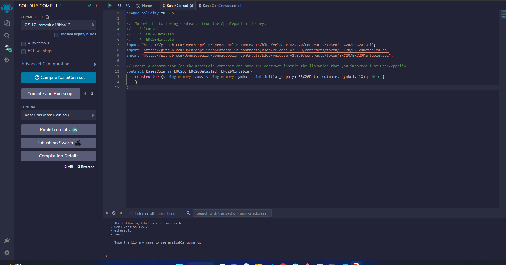
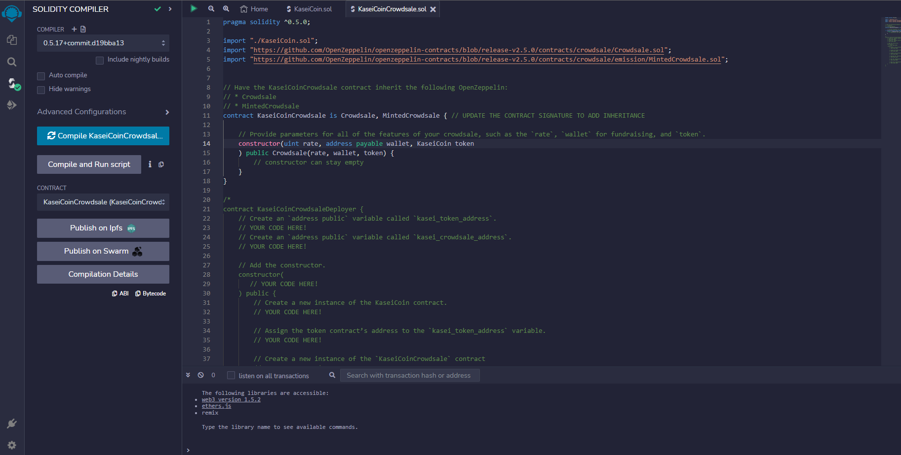
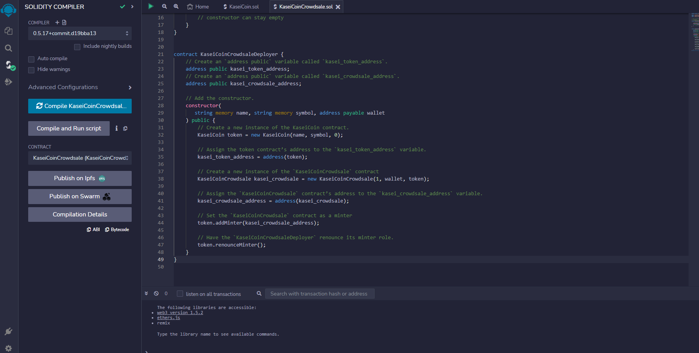
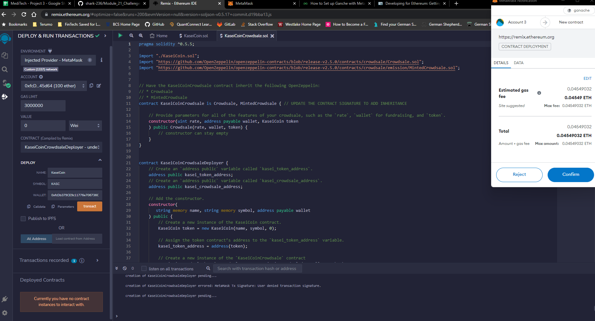
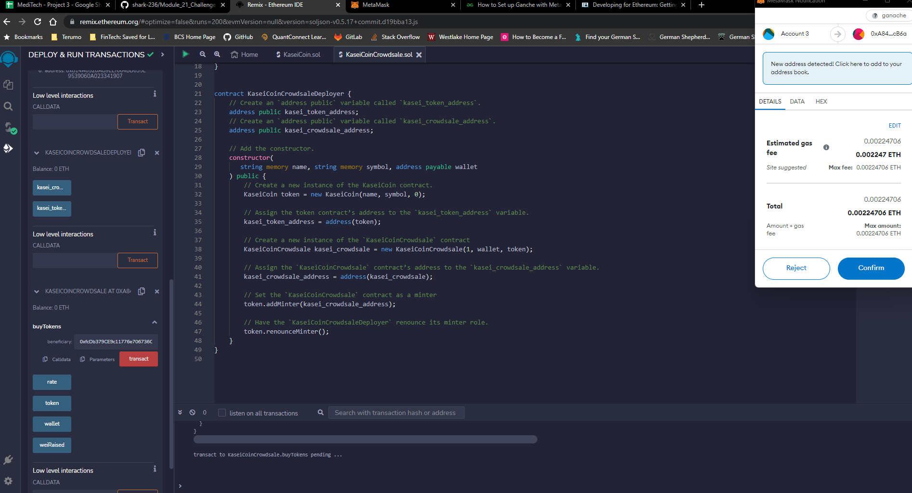
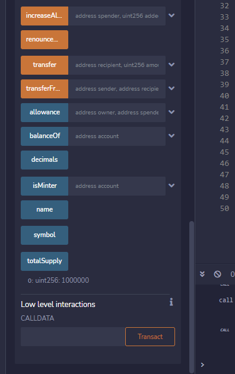
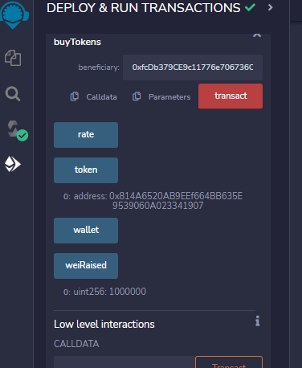

# Module_21_Challenge
Goal: To develop a monetary system for a Mars colony, based on blockchain technology. This monetary system incorporates a new cryptocurrency called KaseiCoin with symbol of 'KASC'. In this program we will create an ERC-20 compliant fungible token that will be minted using a crowdsale contract. 

---

## Technologies

This application applies Solidity logic through the Remix IDE. We will use Ganache to create test accounts (housing 100 ETH each). The transactions will be sent through and confirmed by MetaMask.   

---

## Installation Guide  

The Remix IDE is a web-based program and requires no installation. The Remix IDE can be found at remix.ethereum.org.  

If installation of Ganache is required, please visit the Ganache download page:  
https://trufflesuite.com/ganache/   

If installation of MetaMask is required, please visit the MetaMask download page:  
https://metamask.io/download/  

Note: I am not partnered with, sponsored by, or otherwise affiliated with Ganache or MetaMask in any way.   

---

## Usage  

To begin using this application, download the KaseiCoin.sol and KaseiCoinCrowdsale.sol files to your local machine. The .txt files of the same names serve as backups, to copy and paste into new files created in Remix. Navigate to remix.ethereum.org and upload the saved .sol files (or, launch a new file in the IDE and copy and paste the code from the .txt files). Compile and deploy each contract and begin minting your KASC. 

---

## Evaluation Evidence   

Successful Compilation of the KaseiCoin contract:  

Successful Compilation of the KaseiCoinCrowdsale contract:  
  

Successful Compilation of the KaseiCoinCrowdsale Deployer:  
  

Successful Deployment of the Crowdsale to a Local Blockchain:  
  

Successful Purchase of New Tokens:  
  

Total Supply of Tokens After One Transaction:  
  

Total Wei Raised After One Transaction:  

---

## Contributors

Shahrukh Alam

---

## License

Columbia Engineering: FinTech Bootcamp